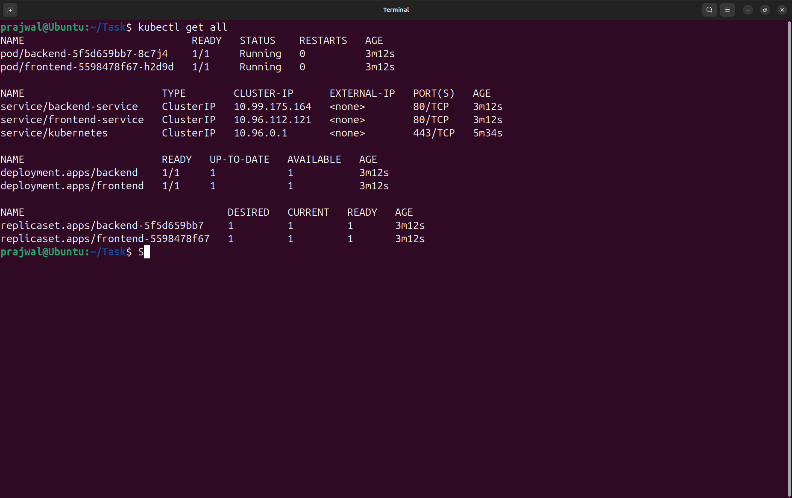
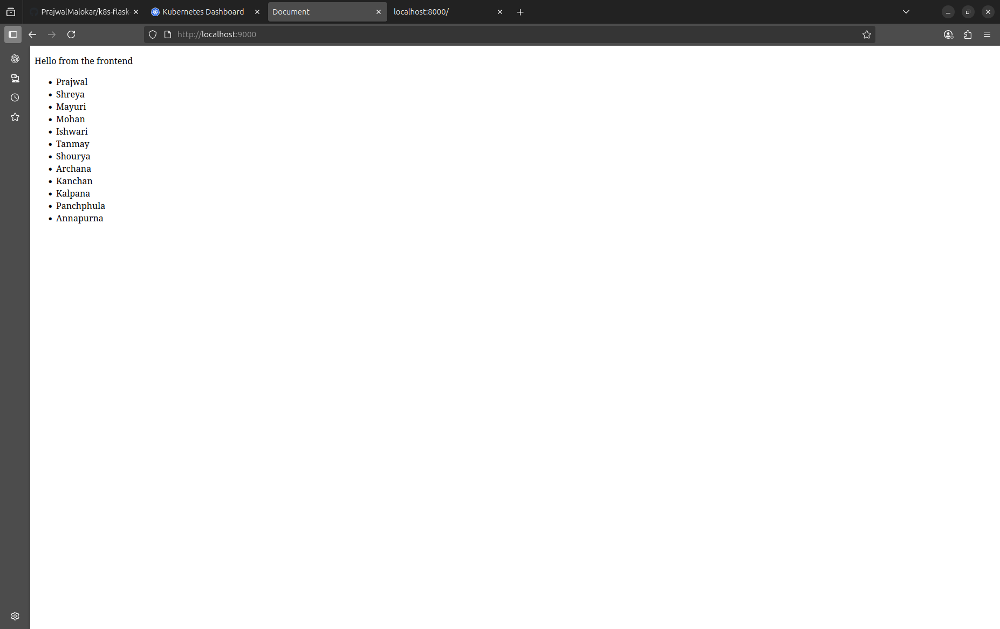
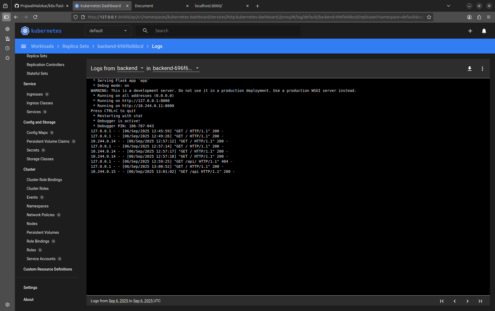
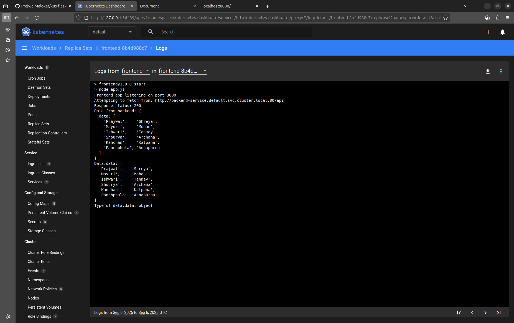

# k8s-flask-express-deploy

## 📌 Project Overview

This project demonstrates deploying a **Flask backend** and an **Express (Node.js) frontend** into a **Kubernetes cluster** running locally with **Minikube**. The frontend form (Express) sends requests to the backend (Flask), and both services are containerized with Docker and orchestrated using Kubernetes.

---

## 🛠️ Tech Stack

* **Frontend**: Node.js + Express
* **Backend**: Python + Flask
* **Containerization**: Docker
* **Orchestration**: Kubernetes (Minikube)
* **Cluster Driver**: Docker

---

## 📂 Folder Structure

```
project-root/
├── frontend/               # Express app (with Dockerfile)
├── backend/                # Flask app (with Dockerfile)
├── k8s/                    # Kubernetes manifests
│   ├── frontend.yaml
│   └── backend.yaml
├── screenshots/
└── README.md
```

---

## 🚀 Setup Instructions

### 1. Start Minikube with Docker Driver

```bash
minikube start --driver=docker
```

### 2. Build & Push Docker Images

*(Replace `prajwalmalokar` with your Docker Hub ID)*

```bash
# Frontend
cd frontend
docker build -t prajwalmalokar/express-frontend:latest .
docker push prajwalmalokar/express-frontend:latest

# Backend
cd ../backend
docker build -t prajwalmalokar/flask-backend:latest .
docker push prajwalmalokar/flask-backend:latest
```

### 3. Apply Kubernetes Manifests

```bash
cd ../k8s
kubectl apply -f backend.yaml
kubectl apply -f frontend.yaml
# or apply everything in the folder
kubectl apply -f .
```

### 4. Verify Deployments

```bash
kubectl get all
```

### 5. Access Frontend in Browser

```bash
minikube service frontend-service --url
```

Open the given URL in your browser to see the frontend form.

---

## 📸 Screenshots

### 1. Kubernetes Resources Running



### 2. Frontend List Running in Browser



### 3. Backend Logs Showing Request Handling



### 4. Frontend Logs



---

## ✅ Deliverables

* GitHub Repository with:

  * `frontend/` + Dockerfile
  * `backend/` + Dockerfile
  * `k8s/` manifests
  * `.gitignore`
  * `README.md`
* Screenshots of deployments, logs, and frontend form

---

## License

MIT License © 2025 PrajwalMalokar. Permission is hereby granted to use, copy, modify, and distribute this software with attribution and inclusion of this notice.

